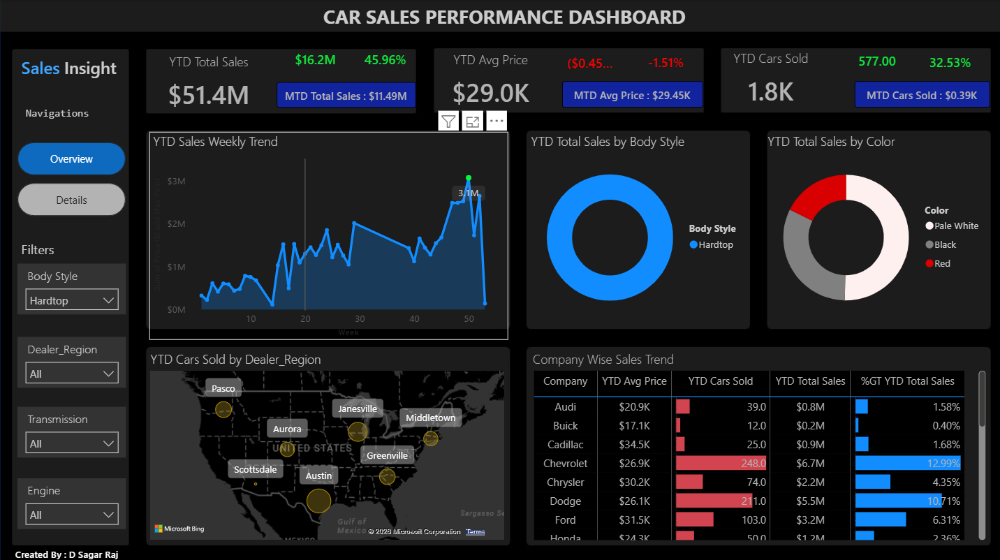

# Car Sales Dashboard

An interactive Power BI Dashboard built using Microsoft Excel and Power BI to analyze car sales performance, identify market trends, and provide actionable business insights through dynamic visualizations.

#📌 Project Overview

The "Car Sales Dashboard" is a business intelligence solution developed to transform raw car sales data into meaningful insights. Using Microsoft Excel as the data source and Power BI for visualization, 
this dashboard enables users to monitor key performance indicators (KPIs), analyze sales trends, and evaluate business performance across different dimensions.
The dashboard is fully interactive, allowing users to explore sales data through filters and slicers for better decision-making.

# 🛠 Tools & Technologies

- Microsoft Excel
- Microsoft Power BI

#📊 Dashboard Features

#KPI Cards
- Total Sales
- Total Cars Sold
- Average Selling Price

# Sales Analysis
- Monthly Sales Trend
- Sales by Manufacturer
- Sales by Vehicle Body Style
- Sales by Dealer Region
- Sales by Color
- Sales by Transmission
  

# Interactive Features
- Dynamic Filters
- Interactive Slicers
- Drill-down Visualizations

<h2>📷 Dashboard Preview</h2>

  
  

# 📈 Key Business Insights

- Identified the top-performing vehicle manufacturers based on total sales.
- Analyzed monthly sales trends to identify seasonal demand patterns.
- Compared sales performance across different dealer regions.
- Evaluated customer preferences based on vehicle body style, color, and transmission type.
- Enabled interactive filtering for quick and effective business analysis.

# 💡 Skills Demonstrated

- Data Cleaning
- Data Preparation
- Data Visualization
- Dashboard Design
- KPI Reporting
- Business Intelligence
- Interactive Reporting
- Microsoft Excel
- Microsoft Power BI

#📂 Repository Structure

Car-Sales-Dashboard
│
├── Car Sales Dashboard.pbix
├── Dashboard Overview.png
├── Car Sales Dataset.xlsx
└── README.md

#🎯 Business Objective

The primary objective of this dashboard is to help business stakeholders monitor sales performance, identify growth opportunities, 
and make informed decisions by providing a comprehensive overview of car sales data through interactive visualizations.

#🚀 Future Enhancements

- Profit Margin Analysis
- Customer Segmentation
- Sales Forecasting
- Geographic Sales Mapping
- Customer Demographics Analysis

---

#👨‍💻 Author

D Sagar Raj

##Connect with Me

- **GitHub:** https://github.com/SagarRaj-17
---

⭐ If you found this project helpful or interesting, feel free to star the repository!
