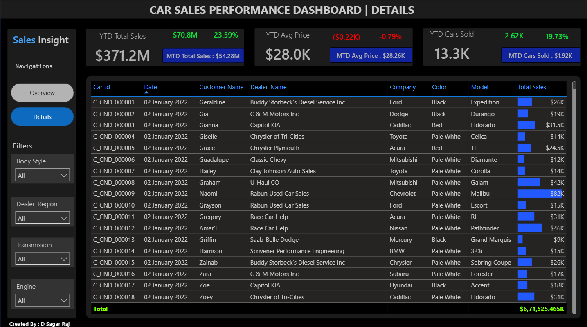

# Car Sales Dashboard

An interactive Power BI Dashboard built using Microsoft Excel and Power BI to analyze car sales performance, identify market trends, and provide actionable business insights through dynamic visualizations.

#📌 Project Overview

The "Car Sales Dashboard" is a business intelligence solution developed to transform raw car sales data into meaningful insights. Using Microsoft Excel as the data source and Power BI for visualization, 
this dashboard enables users to monitor key performance indicators (KPIs), analyze sales trends, and evaluate business performance across different dimensions.
The dashboard is fully interactive, allowing users to explore sales data through filters and slicers for better decision-making.

# 🛠 Tools & Technologies

- Microsoft Excel
- Microsoft Power BI

#📂 Dataset

The dataset used in this project contains car sales information including:

- Sales Date
- Vehicle Manufacturer
- Vehicle Model
- Body Style
- Transmission Type
- Dealer Region
- Selling Price

The dataset was prepared in Microsoft Excel and imported into Power BI for analysis.

# 🎛 Dashboard Features
• Interactive slicers
• Dynamic filtering
• Drill-through analysis
• KPI cards

# Sales Analysis
- Sales by Manufacturer
- Sales by Vehicle Body Style
- Sales by Dealer Region
- Sales by Color
- Sales by Transmission
  

# 📷 Dashboard Preview

  
  

# 📈 Key Business Insights

- Tracked Total Sales, Cars Sold, and Average Selling Price through interactive KPI cards.
- Monitored Year-to-Date (YTD), Month-to-Date (MTD), and Year-over-Year (YOY) sales performance.
- Identified the highest-performing vehicle manufacturers and body styles.
- Compared sales across dealer regions to evaluate regional market performance.
- Analyzed monthly sales trends to identify growth patterns and seasonal demand.
  

# 💡 Skills Demonstrated

- Data Cleaning
- Data Preparation
- Data Visualization
- Dashboard Design
- KPI Reporting
- Business Intelligence
- Interactive Reporting
- Microsoft Excel
- Microsoft Power BI

#🎯 Business Objective

The primary objective of this dashboard is to help business stakeholders monitor sales performance, identify growth opportunities, 
and make informed decisions by providing a comprehensive overview of car sales data through interactive visualizations.

#🚀 Future Enhancements

- Profit Margin Analysis
- Customer Segmentation
- Sales Forecasting
- Geographic Sales Mapping
- Customer Demographics Analysis

---

#👨‍💻 Author

D Sagar Raj

##Connect with Me

- **GitHub:** https://github.com/SagarRaj-17
---

⭐ If you found this project helpful or interesting, feel free to star the repository!
